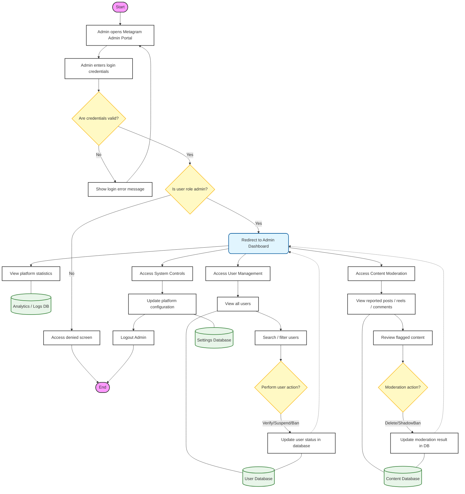

# Metagram Admin Flow Diagram 🛡️

Title: **System Architecture - Administrative Governance Flow**

---

### **Quick Mapping for Viva Presentation**
| Step | Action Type | Database Model |
| :--- | :--- | :--- |
| **Auth** | Decision | `User` (field: `role`) |
| **User Mgmt** | Process | `User` (field: `isActive`) |
| **Moderation** | Process | `Post`, `Reel`, `Comment` |
| **Stats** | Analytics | `User.countDocuments()`, etc. |

---
**Document Status: Viva-Ready | Metagram Project Documentation**
