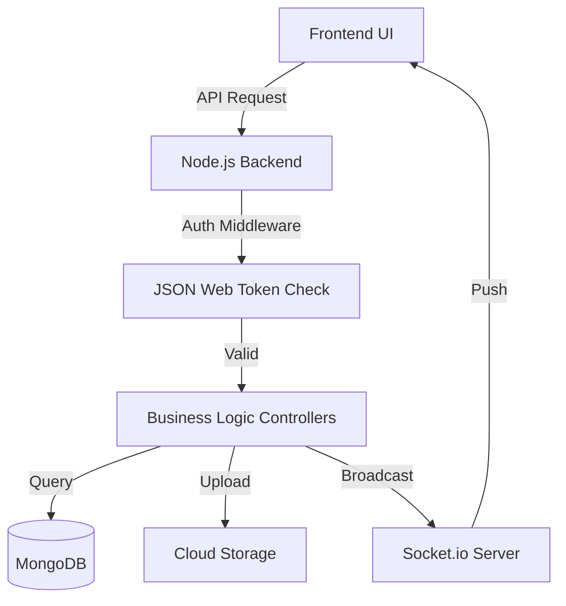

# Metagram | Full System Documentation

A professional, end-to-end documentation for the **Metagram** SaaS platform, detailing user experiences, administrative controls, and system architecture.

---

## 1. System Overview
Metagram is a high-engagement social media platform designed for real-time interactions, media sharing, and robust administrative oversight. It follows a dual-portal architecture separating public-facing user features from private administrative management.

### Key Modules:
- **Auth Engine:** Secure multi-role authentication.
- **Social Feed:** Images, Videos, Reels, and Stories.
- **Real-Time Communication:** Chat, Notifications, and Live Updates.
- **Admin Command Center:** Content moderation and system health.
- **Engagement Engine:** Likes, Comments, Shares, and AI-driven Discovery.

---

## 2. User Flow: End-to-End Experience

The User Flow is optimized for retention and ease of content creation.

### 2.1 Onboarding & Authentication
1. **Landing:** User arrives at the login/signup page.
2. **Registration:** Enters Email, Username, Full Name, and Password.
3. **Verification:** OTP or link-based email validation (if enabled).
4. **Profile Setup:** Uploads avatar, adds bio, and selects initial interests.
5. **Session Management:** JWT is stored in an HTTP-only cookie for secure, persistent sessions.

### 2.2 Content Interaction
1. **Home Feed:** Scroll through a dynamic feed of followed accounts and suggested content.
2. **Discovery (Explore):** Search for users, keywords, or trending hashtags.
3. **Reels & Stories:** Engage with vertical short-form video or temporary 24-hour status updates.
4. **Engagement:**
   - Double-tap to Like.
   - Reply to threads in the comments section.
   - Bookmark posts to "Saved" collections.

### 2.3 Real-Time Messaging
1. **Inbox:** Side-menu access to all direct conversations.
2. **Chat Interface:** Instant message exchange via Socket.io.
3. **Media Sharing:** Send images/videos directly within the chat.
4. **Presence:** Real-time online/offline status indicators.

---

## 3. Admin Flow: Control & Governance

The Admin Flow ensures the platform remains safe, compliant, and scalable.

### 3.1 Administrative Access
1. **Admin Portal:** Accessible only to users with the `isAdmin: true` flag in the database.
2. **Admin Dashboard:** High-level metrics showing:
   - Total Users vs. Active Users.
   - Total Posts & Daily Engagement.
   - System Uptime and Server Health.

### 3.2 User Management Screen
- **User List:** Search and filter users by status.
- **Account Actions:**
   - **Verify:** Grant "Verified" badges to legitimate creators.
   - **Suspend/Ban:** Temporarily or permanently disable accounts for TOS violations.
   - **Reset Password:** Manually trigger a password reset for users in need.

### 3.3 Content Moderation Screen
- **Flagged Queue:** Views all posts/comments reported by users.
- **Review Panel:** Admin compares flagged content against platform guidelines.
- **Resolution:**
   - **Dismiss:** Mark as "Safe."
   - **Delete:** Permanently remove the content.
   - **Shadow Ban:** Content remains visible to the author but hidden from the general feed.

---

## 4. Module-Wise Technical Breakdown

### 4.1 Post Module (`/backend/controllers/post.controller.js`)
- **Functions:** Create Post, Delete Post, Like/Unlike, Add Comment.
- **Storage:** Metadata in MongoDB; Image/Video files in Cloudinary.
- **Validations:** File type check (JPEG/PNG/MP4), character limit for captions (2200 chars).

### 4.2 Reel & Story Module (`/backend/controllers/story.controller.js`)
- **Features:** Vertical video support, story expiry logic via background cron jobs (or TTL indexes).
- **Flow:** User uploads -> File is optimized -> Added to Story collection -> Expires in 24h.

### 4.3 Notification Module (`/backend/controllers/notification.controller.js`)
- **Types:** Like, Comment, Follow, Mention, System Updates.
- **Delivery:** 
  - **Live:** Broadcast via Socket.io.
  - **Persistent:** Saved to DB for the user to view in the "Activity" tab later.

---

## 5. Business Rules & Validations

### 5.1 Business Rules
- **Unique Identification:** No two users can share the same email or username (Lower-cased & Sanitized).
- **Private Accounts:** Content only visible to approved followers.
- **Age Restriction:** Platform restricted to 13+ (enforced at signup).

### 5.2 Success & Error Handling
- **Success:** Status 200/201 with descriptive success messages.
- **Error Types:**
  - **401 Unauthorized:** Invalid or expired token.
  - **403 Forbidden:** User attempting to delete someone else's post.
  - **429 Too Many Requests:** Rate limiting for spam prevention.
  - **500 Internal Server Error:** Fail-safe message with internal ID for logging.

### 5.3 Permissions & Roles
| Role | Content Access | User Management | Moderation |
| :--- | :--- | :--- | :--- |
| **Standard User** | View Public/Friends | No | No |
| **Moderator** | View All | No | Flag/Delete Content |
| **Super Admin** | View All | Full Access | Full Access |

---

## 6. Data Architecture (Flow Diagram)

---

## 7. Edge Case Considerations
- **Slow Network:** Lazy loading for images and skeleton screens during API fetches.
- **High Traffic:** Redis caching for trending posts and frequently accessed profiles.
- **Concurrent Deletion:** Handling cases where an admin deletes a post while a user is typing a comment on it.

---
---

## 8. Easy-to-Understand System Guide (Teacher Mode) 🎓

Hello! Let's imagine **Metagram** is like a big, magical school. Every time a student (User) does something, we write it down in different "Special Notebooks" (Database Models). Here is how it works:

### 🎒 8.1 Joining the School (Registration & Login)
- **What happens?** A new student comes to the school. They give us their Name, Email, and a secret Password.
- **The Notebook (Model):** We write this in the **`User` Model**.
- **Teacher's Note:** Before they join, we check if their Name is already taken. If everything is okay, we say "Welcome!" and let them into the **Home Page**.

### 🤝 8.2 Making Friends (Follow & Unfollow)
- **What happens?** You see another student and want to see what they are doing. You click "Follow."
- **The Notebook (Model):** This is also kept in the **`User` Model**. Each student has two lists in their notebook:
  1. **`followers`**: A list of people who like them.
  2. **`following`**: A list of people they like.
- **Teacher's Note:** If you "Unfollow," we just erase the name from the list!

### 📸 8.3 Sharing Your Day (Posts & Stories)
- **Posts:** Like a drawing you pin to the classroom wall forever. We save this in the **`Post` Model**.
- **Stories:** Like a drawing on a whiteboard that gets erased after 24 hours. We save this in the **`Story` Model**.
- **Reels:** Like a fun video show-and-tell. We save this in the **`Reel` Model**.

### 💬 8.4 Passing Secret Notes (Live Chat)
- **What happens?** You want to talk to one friend privately. You send a message, and it appears instantly!
- **The Notebooks (Models):**
  1. **`Conversation` Model:** This is like a "File Folder" that holds the talk between you two.
  2. **`Message` Model:** This is the actual "Note" you wrote. It says who sent it, who gets it, and what it says.
- **Teacher's Note:** If you "Delete" a chat, we just throw that specific note in the trash bin.

### 🔔 8.5 The School Bell (Notifications)
- **What happens?** Someone likes your drawing or follows you. You get a little "Ding!" 
- **The Notebook (Model):** We write this in the **`Notification` Model**.
- **Teacher's Note:** This notebook tells the student: "Hey! Something happened while you were away!" It saves the type (Like/Follow) and who did it.

### 🛡️ 8.6 The Principal's Office (Admin Panel)
- **What happens?** The Principal (Admin) looks at all the notebooks to make sure everyone is being nice.
- **The Notebook (Model):** The Principal uses the **`User` Model** to find a student and can flip a switch called `isActive`.
  - **Suspended:** Switch is **Off** (User cannot log in).
  - **Active:** Switch is **On** (User can play!).

---

**Prepared for Development Team & System Diagram Creation | Metagram**
